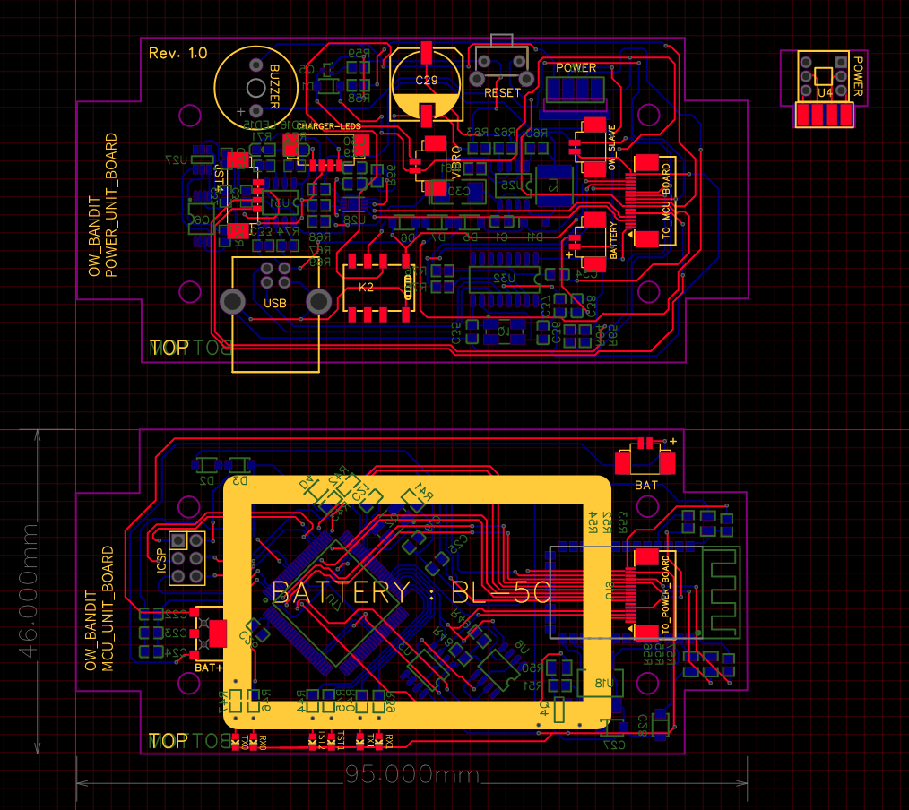
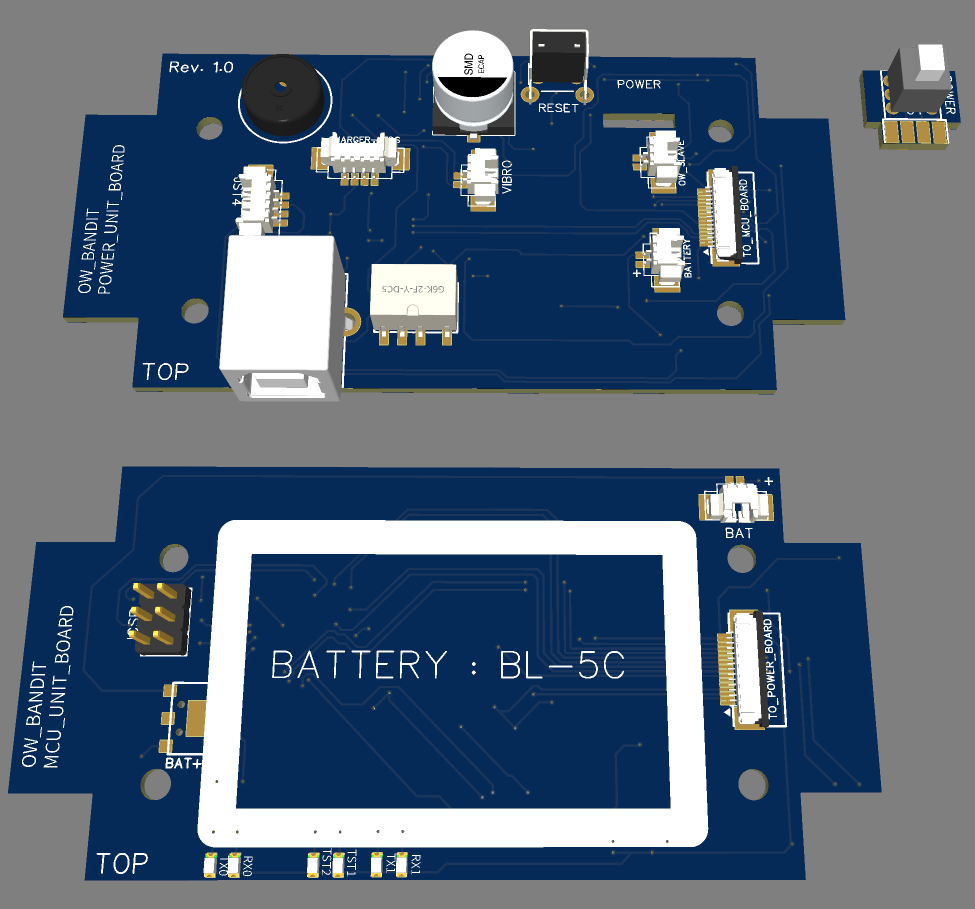
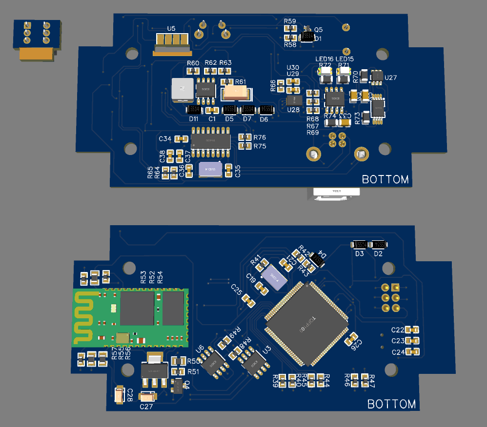

# Bluetooth iButton Reader/Writer/Emulator/Copier

Status : Development

 <!-- .element height="50%" width="50%" -->

 <!-- .element height="50%" width="50%" -->

 <!-- .element height="50%" width="50%" -->

**Diagnostics**

- Install cu if not installed :
 
`sudo apt-get install cu`

`sudo chmod 777 /dev/ttyUSB0`
 
`sudo cu -l /dev/ttyUSB0 -s 9600`


**Features**

``` ####################################### ```

``` #-------Please select function:-------# ```

``` ####################################### ```

``` [0] - Check battery status ```

``` [1] - Read iButton ```

``` [2] - Read iButton and save in memory ```

``` [3] - Get all recorded iButton codes ```

``` [4] - Manual write iButton ```

``` [5] - Write memory value to iButton ```

``` [6] - Clone iButton ```

``` [7] - Emulate iButton```

``` [8] - Manual write to memory ```

``` [9] - Read memory values ```

``` [A, a] - Sound beacon ```

``` [h, H, m, M, ?] - Back to main menu ```

```======================================= ```

```Command could not be longer than 1 char ```

```======================================= ```
``` ```


**Circuit board**

Used Proteus 7.10

Path : ```~/.wine/drive_c/Program Files/Labcenter Electronics/Proteus 7 Professional```

visit: ```https://github.com/gutierrezps/proteus-lib```

### Preparation:

First install `avrdude`:
- `sudo apt install -y avrdude`

Install `avr-gcc toolchain`:
- `sudo apt install -y gcc-avr binutils-avr avr-libc`

For more info check this: http://maxembedded.com/2015/06/setting-up-avr-gcc-toolchain-on-linux-and-mac-os-x/

----------------------------------------------------------------------------------------------------
##### GNU size (GNU Binutils) 2.26.20160125
##### avrdude version 6.3, URL: <http://savannah.nongnu.org/projects/avrdude/>
